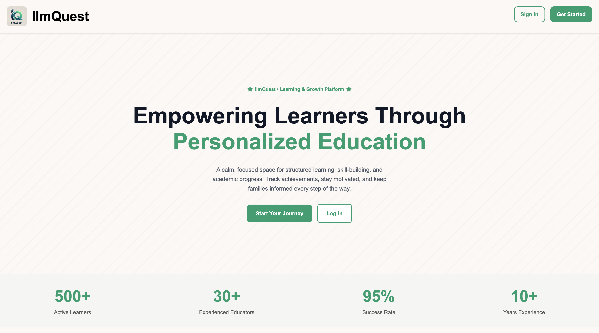
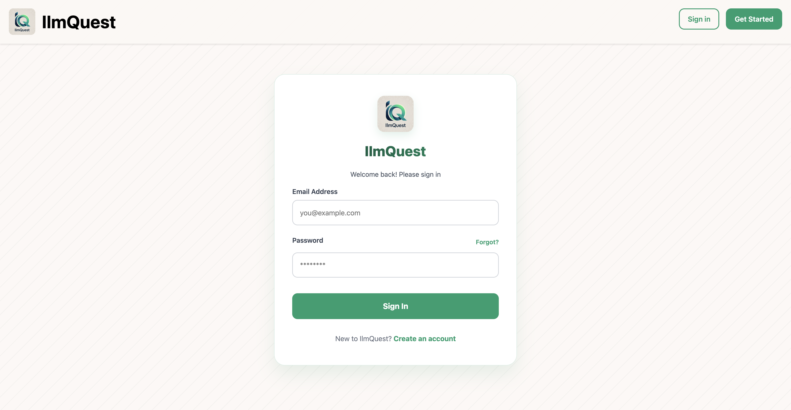
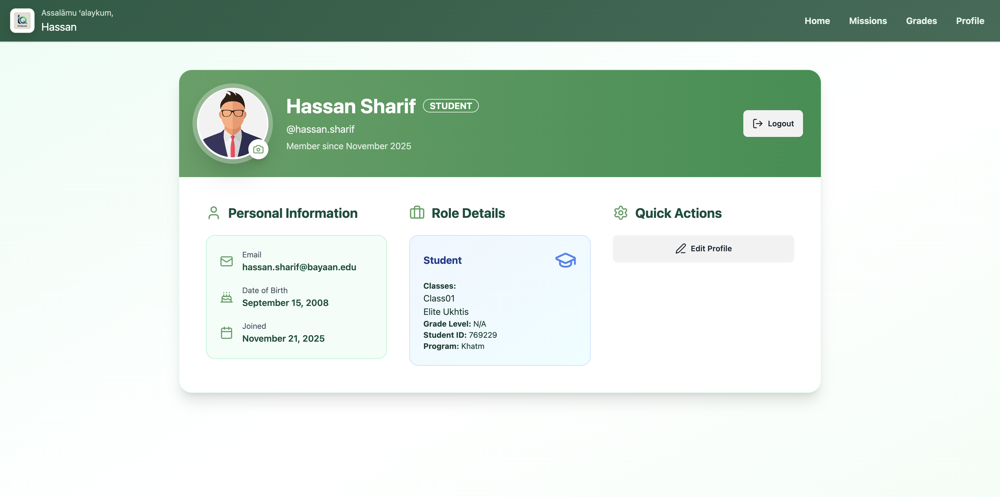

# IlmQuest (iteration0)

IlmQuest is a web app for Islamic schools and madrasas that blends class management with gamified missions, grades, attendance, and parent-facing updates. This iteration is a Node/Express + MongoDB build using EJS on the server side.

## Quick start
```bash
cd iteration0
npm install
cp config/.env.example config/.env  # or create config/.env manually
npm start
```

`config/.env` needs:
```
PORT=2121
DB_STRING=your-mongodb-uri
CLOUD_NAME=your-cloudinary-cloud-name
API_KEY=your-cloudinary-api-key
API_SECRET=your-cloudinary-api-secret
```

## What’s inside
- **Admin/Teacher/Student/Parent portals** built with EJS and themed CSS.
- **Missions** (gamified tasks with ranks, XP, due dates), **Grades**, **Attendance**, **Library/Posts**, **Profiles**.
- **Seeds**: `seed.js`, `seedHadith.js` to load sample data (after env + DB configured).

## Paths to explore
- `views/` — EJS templates (admin, teacher, student, parent).
- `controllers/` — route handlers for auth, home, posts, missions, etc.
- `models/` — Mongoose schemas (users, classes, missions, grades, reflections, verses, attendance, communications, posts).
- `public/` — static assets (CSS, images, JS).
- `routes/` — Express routes.

## Snapshots
- 
- 
- 

## Scripts
- `npm start` — run server with nodemon.

## Iterations
This folder is iteration0. Keep future work in iteration1+ folders to preserve history.
